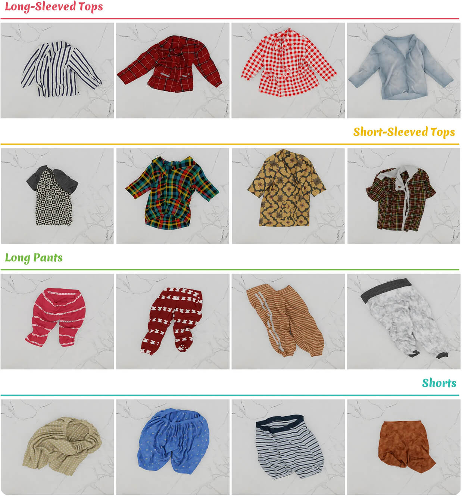
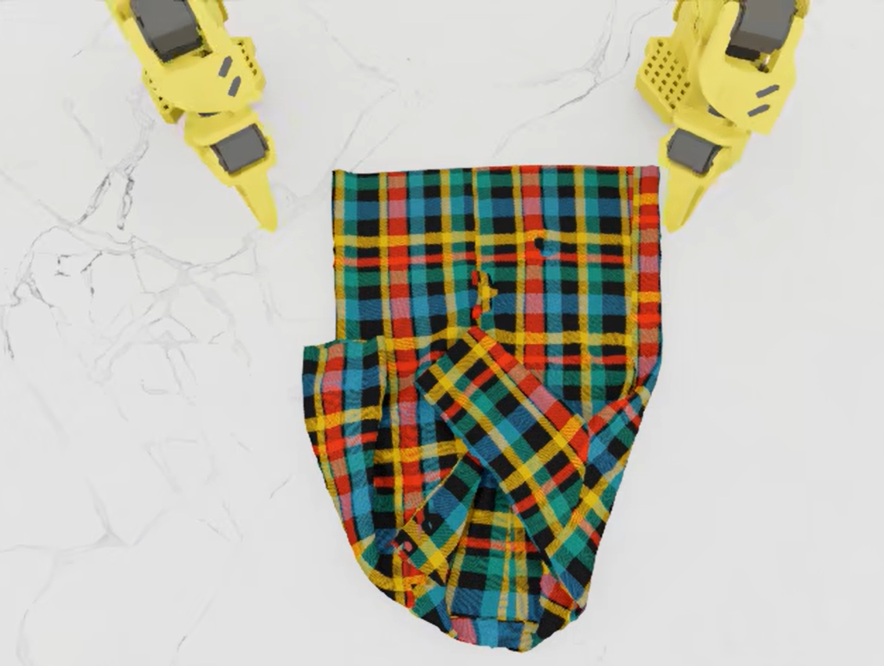
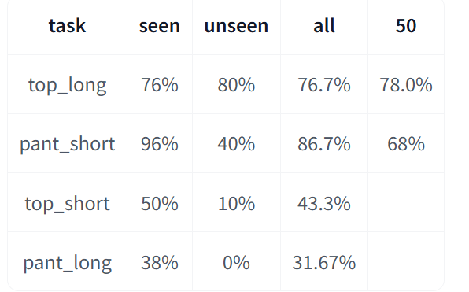
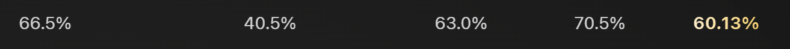
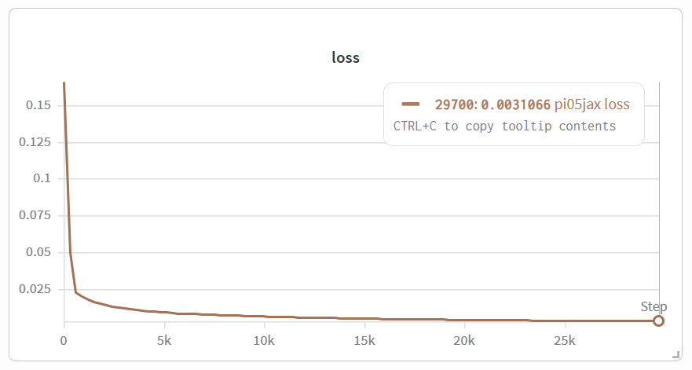
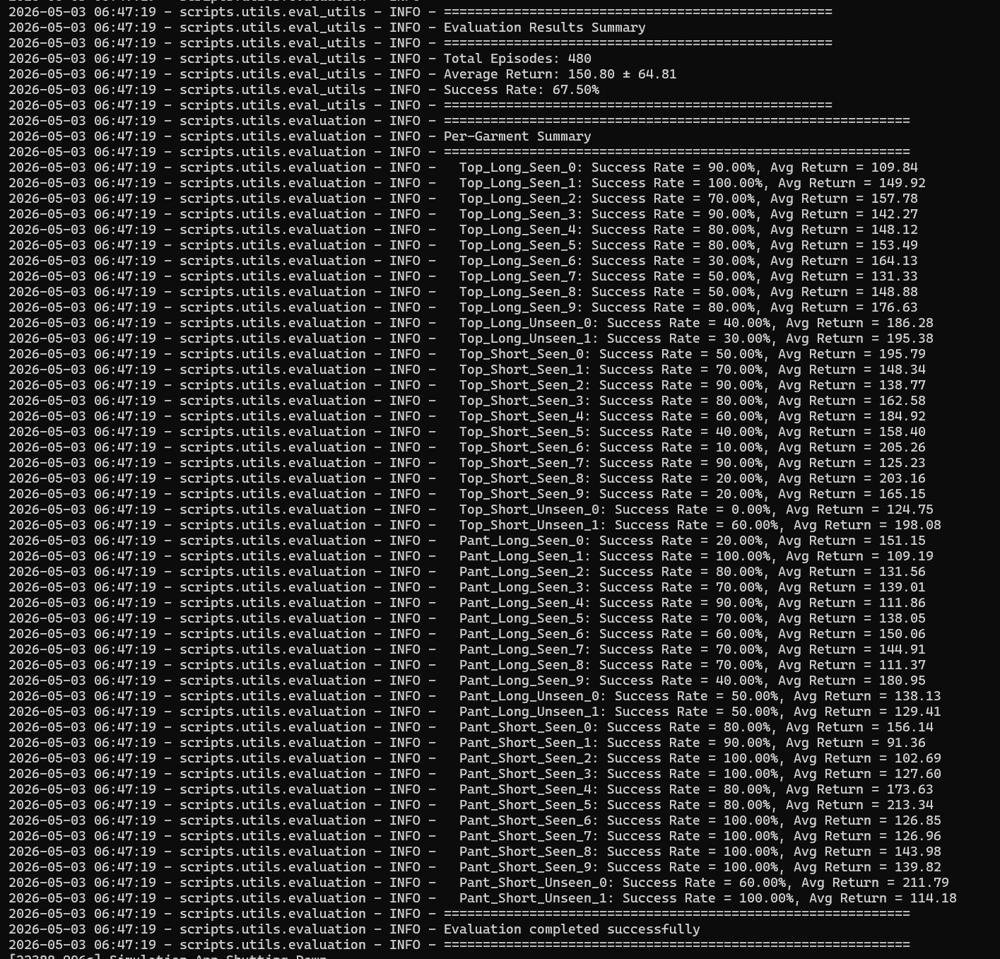

## [lehome challenge](https://lehome-challenge.com/)

这是我参加的第一个具身智能的比赛，比赛3月初开始，4月底结束，历时两个月。不过我其实在4月多才开始接触到并开始训练(主要还是一个xhs求助帖认识了UCAS做具身的一些同学，然后把我拉进了他们的队伍)。

这个比赛要求训练模型操作lerobot机械臂(action dim=12)，完成lehome中的4个叠衣服的任务，分别是长袖、短袖、长裤、短裤。每个子任务提供了10件衣服，每一件有25条数据，所以一共有4\*10\*25=1000条数据。



以下将描述我们的参赛过程和对应的细节。

### 一阶段 classifier + ACT

使用resnet对图片中的garment进行分类，得到对应的类别后再使用ACT模型进行动作预测。为每一种类型的衣物单独在其对应的数据上训练一个ACT模型，输入为当前状态和动作历史，输出为当前动作。

输入输出如下
```yaml
  input_features:
    observation.state:
      type: STATE
      shape: [12]
    observation.images.top_rgb:
      type: VISUAL
      shape: [3, 480, 640]
    observation.images.left_rgb:
      type: VISUAL
      shape: [3, 480, 640]
    observation.images.right_rgb:
      type: VISUAL
      shape: [3, 480, 640]
  
  output_features:
    action:
      type: ACTION
      shape: [12]
```

这部分大概就是我加入时队伍的进度，整体上提交后的测评有**42**%的成功率，后续刷分应该提高了一点，但是对比leaderboard上其他队伍的成功率(**60%+**)，还是有不小的差距，所以我基本没有用ACT。


### 二阶段 PI05

这是我主要使用的模型，其他队友也尝试了smolvla/lingbotvla/xvla等模型。

为了方便，我直接用的lehome支持的基于lerobot的pi05来训练，关于是否使用深度图的问题，我决定先不用，因为pi05预训练并没有使用深度信息，所以依然保持和ACT一样的输入输出格式。

队友这里已经有了一版ACT的结果，可以看到top_short比较垃圾，以及对比其他队伍，我们的pant_short会明显第一点。


开始寻找top_short和pant_short差的原因，我一去看了数据集中的视频，发现其实这两个数据集里有些叠的不是很完美。比如下面这张图明显能看到左边的袖子的checkpoint明显是偏外了。还有可能就是短的衣物差距太大了。


于是我想着replay一下数据再训，把里面可能过不了的数据移除了再训。

用单个pi05在完整的过滤后的数据集上训练四种衣物的数据[lehome_pi05](https://huggingface.co/bigbangoslab/lehome_pi05_filter1_best_toplong)



训练出来的top_long已经很优秀了(后两周之前，之后就是神仙打架)，pant_short还行，剩下两个拉完了，甚至无法过拟合，所以我后面就开始准备单独训练top_short和pant_short的checkpoint(与此同时队友收到结果后也开始单独训练这两个)。


### 三阶段 top short

top short是无论用ACT还是pi05都很垃圾的，我也主要去搞这个了。其实这个时候应该就直接去采数据或者收集成功数据去增大数据量了，但是我们还是在搞模型抽奖。

这个时候我发现过滤两次筛掉的不一样，因为数据集信息不够完全复原，于是对top short单独replay 2次只有都通过的才计入最终的数据集。然后从pi05_base开始单独微调。

这个结果被我删了，但是应该是比之前好了不少，但是估计也就50%-60%，还是没有达到预期的像top long那么好，恰好这时队友用全量数据训练的ACT貌似拟合能力不错，在训练集上表现接近80%，于是我也放弃了筛选，转向全部数据了(数据本来就少)，二次微调时，我把chunk size从10设置为50，尝试不同chunk size的效果(没有做严格消融，但是似乎确实变好了，chunk size对于任务的影响详见Mixture of Horizons论文，这段时间我一直在做推理优化和adaptive chunk size，所以关注到了)。

最后的结果是seen 70% unseen 30% avg 67% total 50%，seen能够拟合出来了，[还不错](https://huggingface.co/bigbangoslab/lehome_pi05_top_short_best_10filter2_2_50full)。


### 三阶段 SF PI05

之前在xhs刷到过SF(Spatial Forcing)作者的帖子和评论，这是一种使用辅助任务来提升VLA的3D空间理解能力的方法，感觉可能适合这个任务，因为有不少失败都是因为抓错袖子位置(隔空)或者直接对折不管袖子。这个方法具体是用VLM的中间层特征经过投影和VGGT的3D特征对齐，来提升VLA的空间理解能力。原仓库是基于openpi的，我迁移到了使用lerobot的[pi05](https://github.com/wangerforcs/lehome-challenge-ucas/tree/main/lerobot_policy_pi05_spatial_forcing)上，训练配置和之前差不多，主要是增加了一个辅助任务loss。

不过出乎预料的是，训练出来的模型在测试集上的表现并没有提升，和之前差不多，不知道为什么，放弃。

测试数据找不到了...


### 消极待机

交的checkpoint(ACT3月交的第一发测了，4月初第二次不测,4.16的pi05的不测)主办方也不测，数据也不更新，leaderboard都掉的了末尾了，这段时间训练也没太大提升，就消极怠工了。比赛快结束时4.26实在忍不了了发了个xhs吐槽贴，引来了官方，然后他们才开始加大人力测，我们更新时来到了第4名，这时候才又开始有动力继续做，只剩四五天时间实在紧张。



这一步主要是对比了榜上的其他队伍的成功率，发现还真就又是top short(特别差)和pant short(差了点)，另外两个都是前列。

其实待机时间我们也在采top short的数据，有成功率的就评估时保存，没有成功的unseen就遥操；前者代码有问题，保存的数据很脏(直接用原来的脚本，成功数据中留有失败的数据: 代码中是边写边保存，失败了就清理buffer但是其实已经落盘了)，后者遥操的数据很脏(不熟练)带崩模型，进度一直推的很慢，两天后就掉出前8了。


最后这几天团队确实也在忙(xvla/smolvla)，但是忙的结果并不好，最后也没有很明显的提升，凑出来一版交了；我这边想放弃lerobot，loss大训的慢，而且长期了解到openpi的pi05 jax checkpoint微调比pytorch更好，我就换到了jax，但是来不及了也没有训完，最后测试并不好。





### 失败经验

- 训练时间不够，很多时候loss其实还有下降空间，但是我基本在0.01~0.02就停了，其实还是可以继续降的，这导致在训练集上模型其实还是有不少失败；不过这其实也是时间紧张加上没有那么多算力，我自己用2张H200完整训练要3天左右，很多时候都是中途就停了；
- 意识到数据的重要性但是没有太大作为，太纠结模型的试错和炼丹了。


最后非常感谢和我一起工作的队友们，这是一段充实的经历。