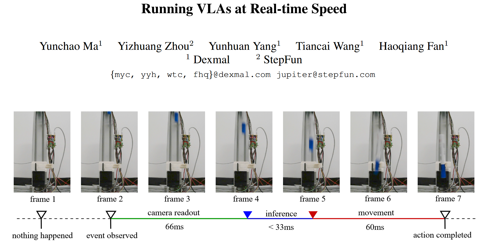
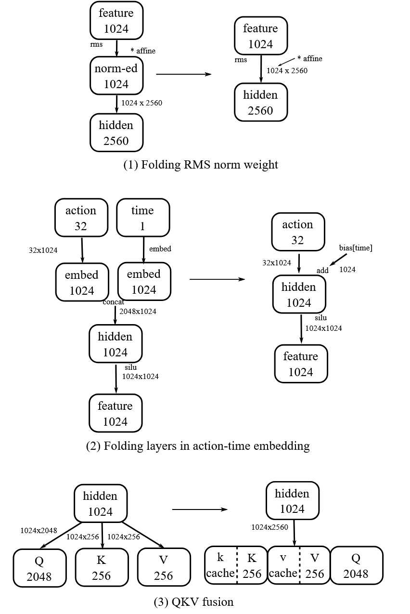

[paper link](http://arxiv.org/abs/2510.26742)




# 📘 一、论文核心问题与贡献

## 🎯 研究问题

* 大规模 **VLA（Vision-Language-Action）模型** 虽然强大，但**推理延迟高（>100ms）**
* 无法满足机器人**实时控制（<33ms，30FPS）**
* 现实任务（如抓取下落物体）需要 **<200ms 反应时间**

---

## 🚀 核心贡献

### 1️⃣ 实现实时VLA推理

* 在 **单张 RTX 4090** 上实现：

  * **30 FPS 视觉推理（≈27ms）**
  * **最高 480 Hz 控制频率 (30*16AE)**
* 比官方实现快约 **2–4倍** 

---

### 2️⃣ 提出系统级优化方法（核心创新）

提出一整套 **工程优化策略（bag of tricks）**：

* 消除 CPU 开销
* 图优化（减少算子）
* Kernel级优化
* 内存/并行优化


---

### 3️⃣ 提出“Full Streaming Inference”框架

* 将 VLA 变为 **流式控制系统**
* 三层控制频率：

  * ⚡ 480 Hz：动作控制（AE）
  * 👁️ 30 Hz：视觉理解（VLM）
  * 🧠 <1 Hz：语言推理

👉 类似人类的“反射 + 感知 + 思考”

---

# 🧠 二、模型背景（π0 VLA）

## 架构组成

论文使用 π0 模型：

### 🧩 两大模块：

1. **VLM（视觉语言模型）**

   * backbone：PaliGemma（≈3B参数）
   * 负责理解图像 + 文本

2. **AE（Action Expert）**

   * ≈300M参数
   * MoE结构
   * 使用 **Flow Matching** 生成动作轨迹

---


# ⚡ 三、性能瓶颈分析


### ❌ 1. CPU调度开销

* 每次推理：

  * > 1000+ 个 CUDA kernel
* Python调度 → 严重瓶颈

---

### ❌ 2. 冗余计算

* 多个线性层、归一化可以合并
* Q/K/V 分开计算，可以拼成大矩阵计算后再拆分

---

### ❌ 3. GPU利用率低

* kernel太碎
* 内存访问不连续

---

# 🔧 四、优化方法（重点）

## 1. 消除CPU开销：CUDA Graph


* 预记录 kernel 执行图
* GPU直接执行（绕过Python）
* 推理速度 **提升约2倍** 

---

## 2. 计算图优化


#### ✔ RMSNorm融合

* 合并到 Linear 层

#### ✔ Action-time embedding融合

* 减少kernel数量

#### ✔ QKV融合

* 三个矩阵 → 一个大矩阵

👉 结果：

* 再减少 **7–8ms**



---

## 3. Kernel级优化

### 主要方法：

#### ✔ Triton自定义GEMM

* 替代 cuBLAS
* 手动调 tile size
* -0.7ms

#### ✔ FFN融合

* 两个线性层 + GELU → 一个kernel
* 并行计算，但是一起load/store
* -1.7ms

#### ✔ Scalar操作融合

* bias + residual + activation 合并
* -4ms

---

## 📉 最终效果（关键表）

| 方法            | 推理时间       |
| ------------- | ---------- |
| naive pytorch | ~105 ms    |
| + CUDA graph  | ~43 ms     |
| + 图优化         | ~35 ms     |
| + kernel优化    | **~27 ms** |

👉 达到实时要求（<33ms）

---

# 📊 五、理论极限（Roofline分析）

论文用 Roofline 模型估算最优性能：

* 理论下界（2 views）：

  * **≈20.6 ms**
* 实际实现：

  * **27.3 ms**

👉 只差 ~30%

📌 结论：

> 已接近硬件极限


看了代码，主要包括了
- 所有提到的kernel优化都用triton写
- attention用pytorch的实现，但是compile优化
- 整个推理录cuda graph

---

# 🔄 六、Full Streaming Inference（核心思想）

## 🌊 核心理念：并行 + 流式

传统：

```
图像 → VLM → AE → 输出
```

改为：

```
VLM 和 AE 并行流式运行
```

---

## 🧠 三层控制系统

| 层级  | 频率       | 功能    |
| --- | -------- | ----- |
| AE  | ⚡ 480Hz  | 实时动作  |
| VLM | 👁️ 30Hz | 视觉理解  |
| LLM | 🧠 <1Hz  | 推理/语言 |

---

## 🔑 关键机制

### ✔ 并行执行

* IO-bound（AE） + compute-bound（VLM）同时跑

### ✔ 高速反馈

* 2ms（动作反应）
* 33ms（视觉反应）

---

## 💡 Insight（很重要）

👉 **VLA不仅是模型，而是控制系统**

---

# 🧪 七、实验验证

## 🧪 任务：抓落下的笔

* 约束：

  * 反应时间 <200ms
* 设置：

  * 30 FPS 摄像头
  * 600 条训练数据

---

## 📈 结果

* 成功率：**100%**
* 达到人类反应水平 

---

## 📌 关键意义

* 证明：

  > 大模型也可以用于**高速控制任务**

---

# 🔍 八、论文核心洞察（总结）

## 💡 Insight 1

> VLA慢，不是模型问题，是系统问题

---

## 💡 Insight 2

> CPU调度是最大瓶颈之一

---

## 💡 Insight 3

> AE 和 VLM 计算特性互补

* AE：IO-bound
* VLM：compute-bound
  👉 可以并行

---

## 💡 Insight 4

> 控制系统应是多频率的

---

## 💡 Insight 5

> 推理优化 ≈ 编译器工程问题

---

# 🔮 九、未来方向

论文提出：

### 1️⃣ 更高帧率（60–120 FPS）

* 需要更多算力 or 低精度

---

### 2️⃣ 更大模型（7B+）

* 利用新GPU（如5090）

---

### 3️⃣ 更高控制频率（>480Hz）

* 更细粒度控制

---

# 🧾 十、一句话总结

**这篇论文的本质贡献是：把“大模型推理”问题，转化为“系统优化与并行调度问题”，从而首次让VLA进入实时机器人控制领域。**