这是研一上在雁栖湖里的一部分工作，没来得及认真总结，研一下走马灯一下。由于隔了半年有些东西都忘记了，主要来自跟老板汇报的飞书文档，可能存在错误，请观者理性辨别。

本人此前对于具身智能/具身仿真器/图形学几乎是一无所知，知识和指导也主要是系统上的，只是受导师安排要做这些(你已经是这个领域的专家了)。谨以此文献给我困难重重的具身智能之路。


### 仿真器加速的研究

仿真器加速做什么？
- 就是让仿真器跑得更快，或者说在同样的时间内能跑更多的仿真环境
  
为什么要加速？
- 强化学习需要大量的交互数据，而仿真器是生成这些数据的工具。
- expert data生成，模仿学习需要专家数据，专家数据通常也可以通过仿真器生成。

#### 前期工作
最先使用的仿真器是maniskill(基于SAPIEN Vulkan)，因为他们的论文标题是`GPU Parallelized Robotics Simulation and Rendering for Generalizable Embodied AI`，符合我想做的GPU加速，而且来自国外大组的开源项目，star也不少。

工作流是policy inference -> env step -> render -> memcpydevicetohost
和仿真器相关并且可优化的主要是render和memcpydevicetohost这两步，前者是渲染加速，后者是数据传输加速。

于是我测试了使用random action的环境在env step, render和copy的时间占比

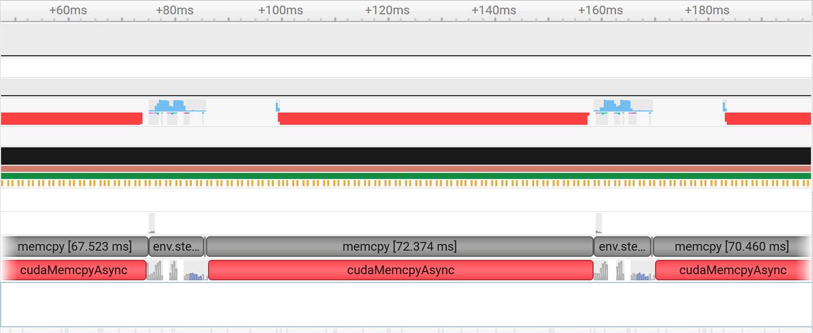

以一个简单环境为例, num_env=128
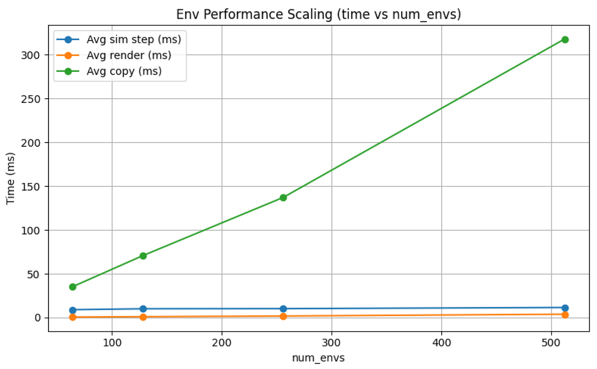

可以看到copy的时间是随着环境数增加剧烈的，我能想到的优化方式是  
copy放在单独的cuda stream里(这样第i步的copy就可以和第i+1步的inference/step并行)，这时使用的是pinned memory(cudaHostAlloc)，因为是DMA比cudaMemcpyAsync更快；
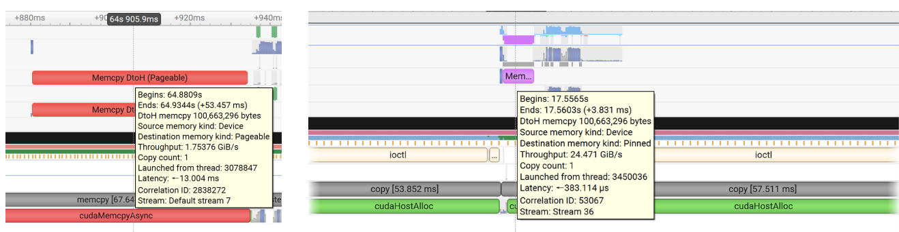
然后为了减少cudaHostAlloc的时间，我选择了手动分配内存和同步，减少cudaHostAlloc的调用次数。
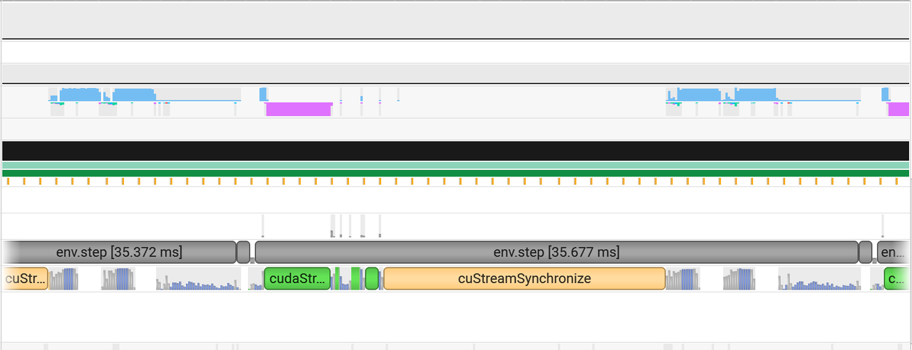
现在出现了cuStreamSynchronize的时间，此时我还没有意识到真正的问题在哪，反而以为是我的stream写的有问题导致的同步过久。其实是因为代码导致拷贝的是旧的渲染结果(粉色)，所以和env.step是并行的，而env.step增长部分里的synchronize(黄色)是在等待真正的上一帧渲染结果，此时渲染还没有完成，直到完成后才可以进行下一步的step(蓝色)。这个问题当时一直困扰，后来再分析才明白时间上的大头是渲染，之前显示的copy时间增长剧烈是因为maniskill底层代码渲染用的是另一个cuda stream，导致我测量的copy时间包含了等待渲染完成的时间。

> 一个插曲
> 当时组里的服务器正从L40换到H200，然后我发现完全相同的配置下，cudaMemcpyAsync的时间增长了很多，还怀疑是驱动问题，但测试了bandwidth正常，而且Throughput也一样，只是从kernel launch到真正开始拷贝的时间多了很多。年轻的小王还以为是因为设备导致的kernel launch时间变长了，但是如果对比L40和H200的参数很容易明白，主要是渲染能力的差别(**RT core和ROP**)，增加的这部分就是等待渲染完成的时间。

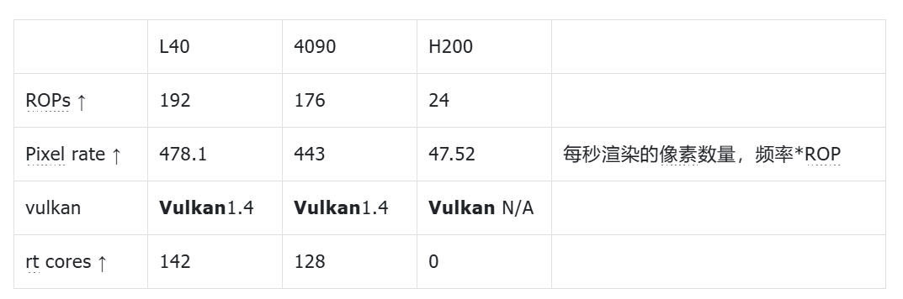
 
>具体是怎么发现的呢？因为就算不拷贝时间也还是这么长。最后定位到self.scene.get_human_render_camera_images，函数本身很快就返回了，但是在实际用到返回的数据的时候(比如输出内容或者dones.any()这种判断)，会强制触发同步，直至数据实际完成。

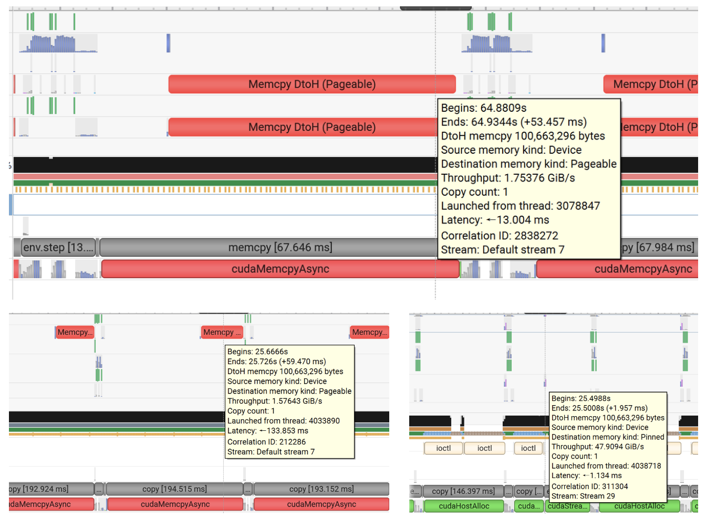

后面开始用4.5M参数的Diffusion Policy加入，PickCube-v1, action horizon=8

图中对应的就是一次推理后，每次step我都强制渲染并保留结果
如果拷贝不单独放在一个copy stream中，那么cudaMemcpyAsync的时间会包含等待渲染完成的时间，而且nsys中也看不到stream sync相关的，挺坑的，导致我完全没往渲染同步上考虑。
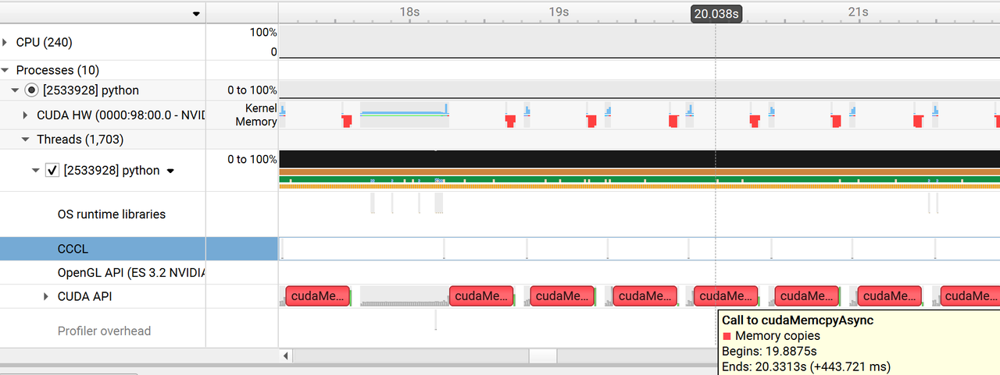
而如果开了copy stream，那就可以清晰地看到cudaStreamSynchronize。
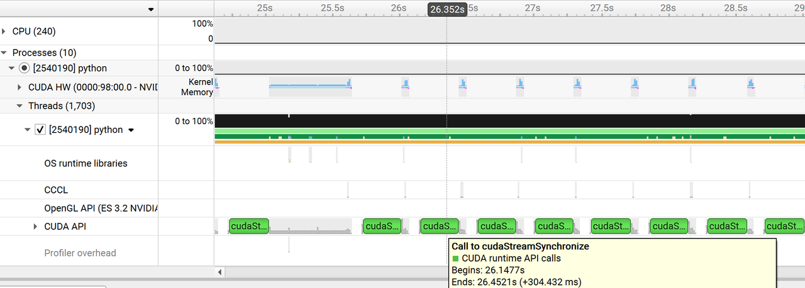
而且如果在实际用数据前先sleep一会，就可以看到sync时间就减少了sleep的时间，验证了上面的结论。
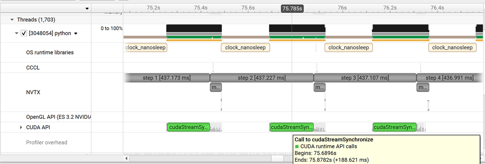

也是在这里我扒了底层代码才看明白原因(解密时刻)

maniskill渲染部分实际调用的是SAPIEN库(C++)的pybind代码，所以之前的项目根本看不到底层实现，于是我下了SAPIEN的代码
> 调用关系：Maniskill -> SAPIEN -> svulkan2(SAPIEN对vulkan封装后的项目) -> vulkan

对应的主要函数为sapien.render.RenderCameraGroup.take_picture，理解了这个函数才可以解释一系列现象

```cpp
void BatchedCamera::takePicture() {
  auto context = SapienRenderEngine::Get()->getContext();

  // make sure previous takePicture has finished
  auto result = context->getDevice().waitSemaphores( // 等待前一帧的完成信号
      vk::SemaphoreWaitInfo({}, mSemaphore.get(), mFrameCounter), UINT64_MAX);

  if (result != vk::Result::eSuccess) {
    throw std::runtime_error("take picture failed: wait for fence failed");
  }

  for (auto &cam : mCameras) { // 对每个camera进行一次渲染调用，提交渲染流程到GPU
    cam->getInternalRenderer().render(cam->getInternalCamera(), {}, {}, {}, {});
  }
  mFrameCounter++;
  context->getQueue().submit(mCommandBuffer.get(), {}, {}, {}, mSemaphore.get(), mFrameCounter,
                             {}); // 拷贝任务提交到GPU执行，执行完会signal mSemaphore, 值为mFrameCounter。这里的command buffer是写一次多次执行的，从physx拷贝到GPU buffer
#ifdef SAPIEN_CUDA
  cudaExternalSemaphoreWaitParams waitParams{};
  waitParams.params.fence.value = mFrameCounter;
  cudaWaitExternalSemaphoresAsync(&mCudaSem, &waitParams, 1, mCudaStream); 
  // mCudaStream等待拷贝完成，也就是把mSemaphore提升到mFrameCounter
#endif
}
```

nsys中的流程

不使用copy stream
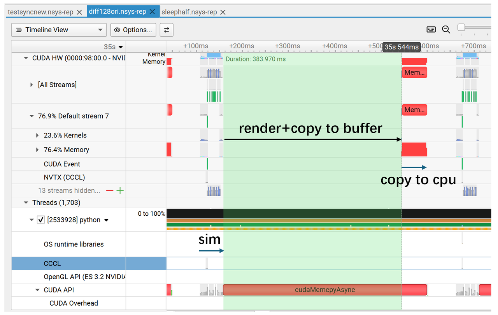

因为copy to buffer完成之前，cudastream是被阻塞的，不允许执行后续加入的kernel(cudaMemorycpyAsync)，所以在CPU的时间轴上显示的就很长。

使用copy stream
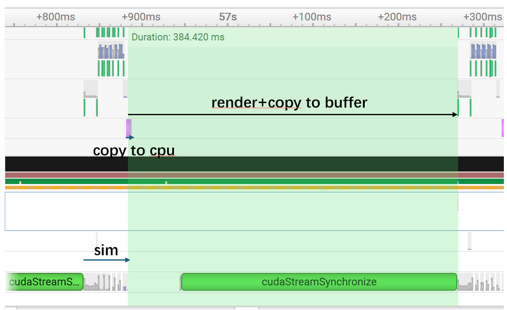

sim之后是render，但是render很快返回(GPU提交了但并没有实际完成)，之前异步的代码认为render完了，就去gpu上拷贝渲染好的图像(这时候是上一帧的)，实际的render一直在进行，但是代码逻辑流中仿真后(如果开渲染的话也在渲染后)插入了一个dones.any来判断是不是完成了任务，这个操作要从gpu拷贝数据，由于cuda stream被阻塞，因此必须等待(render+copy buffer)完成，后续几乎没有处理，直接进入下一个step。

而之前我观察到的copy stream带来的优化原因其实是: 白色的cpu后处理和(render+copy)重叠了，以及图像从GPU到CPU的时间短了(pinned)，大概效果就是128envs时间从550ms到438ms。

也是在这时，我在nsys profiling中了解到了可以开vulkan的，这就很明确了。
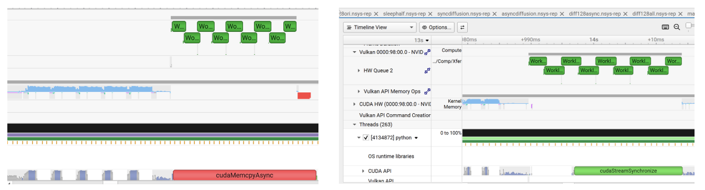


**于是我得出的结论是渲染就是要这么多时间且随着环境数线性增长，render的时间已经卡死了优化的机会。下一步就是去寻找更高性能的render和maniskill的render这么烂的原因。**

第一部分主要是在分析maniskill仿真器运行的时间breakdown，逐步从一个坑中摸索出来，然后跳入另一个坑。

#### 渲染工作

接第一部分，我去调研了一些仿真器的论文/项目，侧重的是render这一部分，并且偏系统上的工作，主要是下面两个。

[High-Throughput Batch Rendering for Embodied AI | SIGGRAPH Asia 2024 Conference Papers](https://dl.acm.org/doi/10.1145/3680528.3687629)

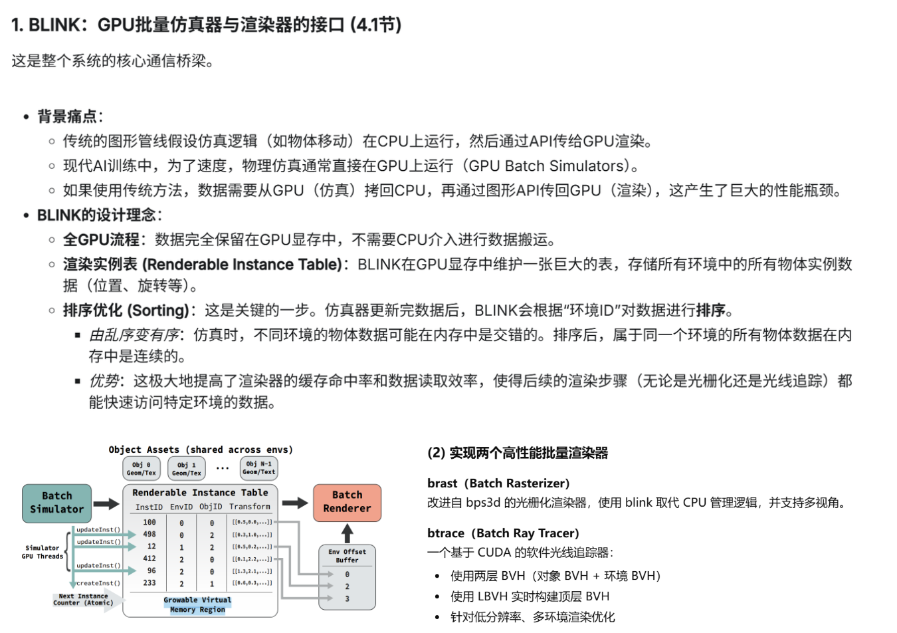

[An Extensible, Data-Oriented Architecture for High-Performance, Many-World Simulation | ACM Transactions on Graphics (TOG)](https://dl.acm.org/doi/10.1145/3592427)

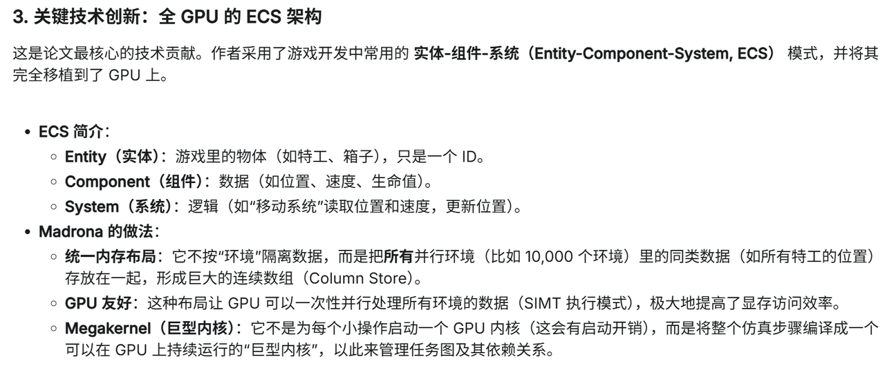
从实现上，一个System就是一个处理的函数，默认表中的一行交给一个 thread处理
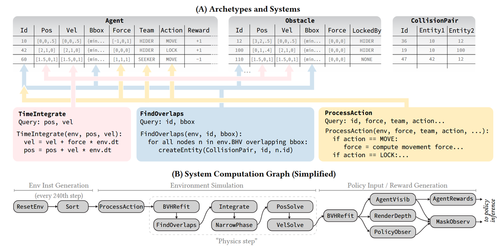

> mujoco playground用了这个madrona batch renderer，强强联合
> SAPIEN3.0重构为了ECS架构，不过和上面那个还不太一样


ok 感觉这个renderer看起来还不错，而且还开源了，我下一计划是去试用下mujoco playground(不得不吐槽环境是真糟糕，二者的readme配置互相引用，有些版本要自己手动调，不知道现在怎么样了)


不过在此之前，我还需要搞明白为什么maniskill的render时间随着环境是是线性增长的。


上面的`BatchedCamera::takePicture`可以看出，每个camera都要经历record and submit的过程，主要包括两个部分
- 将任务(shader and render)录进command buffer
  - 场景更新时需要做，实验中只有每个env第一次step时需要
- 将command buffer任务提交到GPU队列

```cpp
void Renderer::render(scene::Camera &camera, std::vector<vk::Semaphore> const &waitSemaphores,
                      std::vector<vk::PipelineStageFlags> const &waitStages,
                      std::vector<vk::Semaphore> const &signalSemaphores, vk::Fence fence) {
  if (!mContext->isVulkanAvailable()) {
    return;
  }
  if (!mScene) {
    throw std::runtime_error("setScene must be called before rendering");
  }
  SVULKAN2_PROFILE_BLOCK("Record & Submit"); // render的实际调用
  prepareRender(camera);

  if (mAutoUpload) {
    uploadGpuResources(camera);
  }
  //note 有自己的command buffer
  std::vector<vk::CommandBuffer> cbs = {mShadowCommandBuffer.get(), mRenderCommandBuffer.get()};
  mContext->getQueue().submit(cbs, waitSemaphores, waitStages, signalSemaphores, fence);
}
```

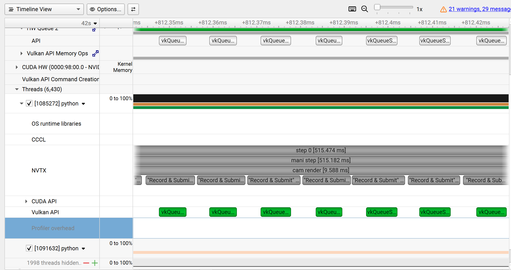

只有第一次load时时间较长12ms, 后续都在20us左右 ，所有camera(512 batch size)都完成大概只要10ms，剩下的400ms都在等待GPU完成任务。

> nsys profile vulkan 似乎只能看到vulkan api, 看不到具体在GPU上执行了什么，只有绿色的workload。而nsight graphics试了下命令行ngfx启动不了, 不支持当前GPU arch进行GPU trace, 用的最新的2025.4不支持hopper架构, 因为H200不算图形卡, 包括 A100这种AI卡; L40可以用。真是困难重重啊，所以我为什么要用H200做实验？因为组里只有一台服务器，挂了H200之前的四卡L40就暂时下架了，被挂到大组集群里了。是我不想用吗？

那H200的渲染细节到底在哪能看呢? 
**[nsys GPU Metrics](https://docs.nvidia.com/nsight-systems/UserGuide/index.html#gpu-metrics)**


SMs Active: 至少有1个warp在运行中的SMs的周期与周期数的比率，活跃SM/总SM
SM Warp Occupancy
- Vertex/Tess/Geometry Warps in Flight: 活跃在SM中的xxx shader warp/SM中最大warp数
- Pixel Warps in Flight: 活跃在SM中的pixel warp/SM中最大warp数
- Compute Warps in Flight: 活跃在SM中的compute shader warp/SM中最大warp数
- Unallocated Warps in Active:  SM(至少有一个分配的warp)上的非活跃warp/SM中最大warp数

N个SM, 每个SM最多M个Warp, 一共运行K个Warp, 活跃SM为Q
前三个都是K/(N*M)，最后一个(可能是)(M*Q-K)/M*N
Unallocated Warps in Active + Compute Warps in Flight 约等于SMs Active

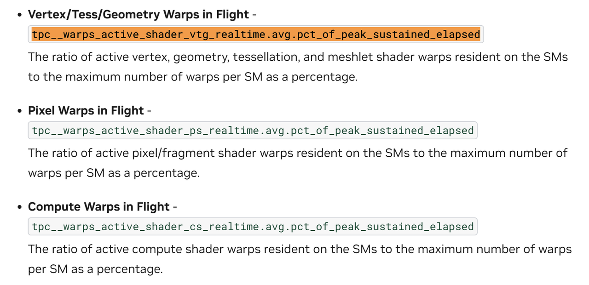


惨淡的利用率，而且不管环境数怎么变，一直都这么低

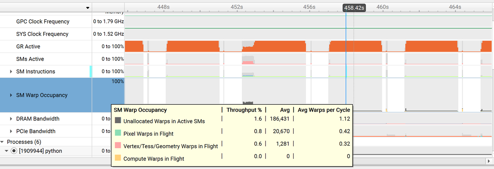

根据我对硬件参数的理解，猜测是渲染ROP太少了，整体卡死在了pixel write上了。

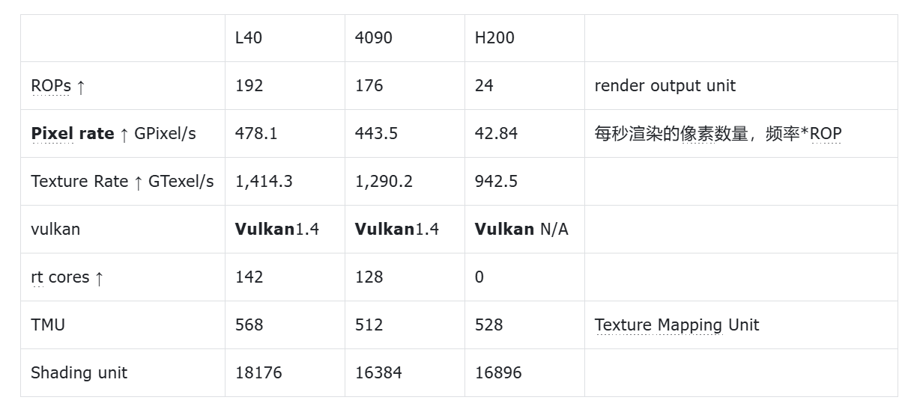

实验证明如下:  
由于像素数只影响最后的Pixel Processing部分，如果要证明Pixel Processing是瓶颈，只需要测试只改变输出的分辨率(像素数)情况下(其余物体数、场景等不变)，渲染时间随像素数(分辨率)的scale关系，只要是线性的，就可以认为渲染卡死在了最末端ROP。

只改变输出分辨率简单跑几组，结果就是非常线性：在envs=128时分辨率从1 x 1到1024 x 1024的渲染时间

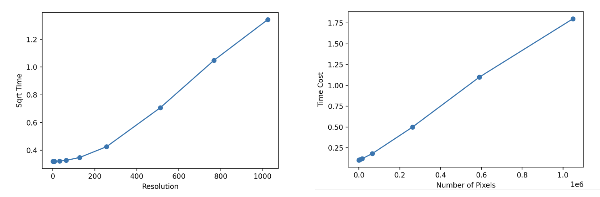

这样导致GPU前端空闲，因此throughput只有3%。

同样我一直拉长GPU Metrics我发现一个震惊的结果：GPU的指标是有周期性的类似的小块，**数了一下连在一起的块数就等于环境数**，那这意思 不就是每个camera的任务都放在GPU上顺序跑？一点并行没有用？Batch Camera并不是Parallel Camera？

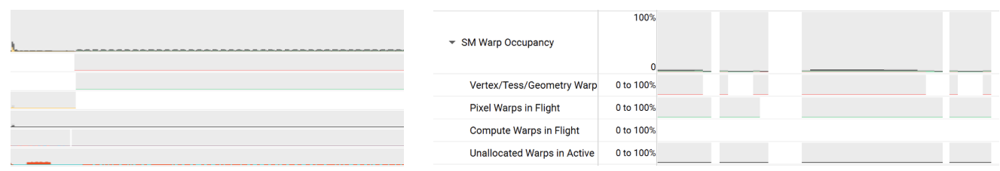

然后我再可视化以下一个块里的warp数量变化(10kHz)

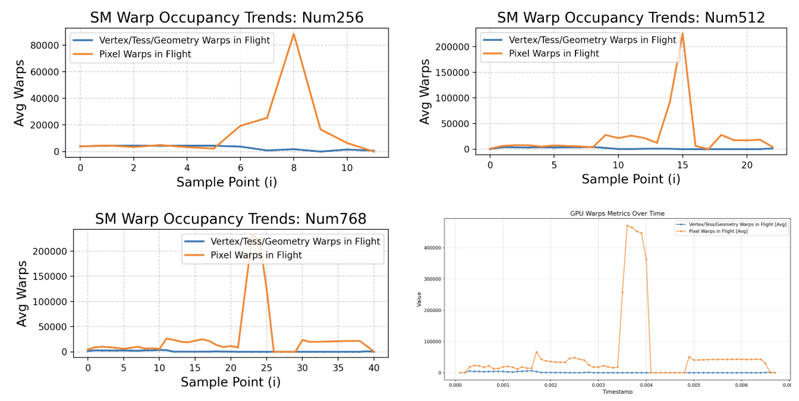

这个趋势我是不太理解的，nsight graphics看一下vulkan api

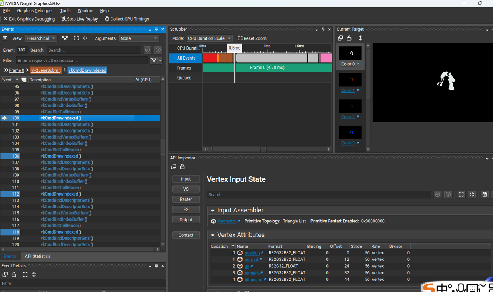

每次完成vkCmdDrawIndexed都完成了一次全流程并且得到了彩色图像。峰值的原因可能是机械臂画完了，开始画背景和带纹理的桌面?

**如果ROP是瓶颈，为什么前一段平稳(pixel在这个水平是基本不干活还是在正常工作?)，在vertex结束后会激增呢？是因为桌面纹理需要画的比较多？灌给了ROP? 如果认为pixel sm高实在阻塞的话，为什么变0后有持续一段时间呢？**

这些问题到现在我也不太明白。

关于batch camera假并行的问题，我提了一个[issue](https://github.com/haosulab/ManiSkill/issues/1348)，后续不知什么原因忘记回复了(应该是去搞mujoco playground了?)


好吧，现在回到mujoco playground。初步测试感觉MuJoCo Playground性能相当不错，只是编译的时间太长了，而且还有我看不太懂的时间消耗。渲染整体时间都少了很多，尤其是每个step中没有周期性的渲染了，同样分辨率(128*128，但场景不太相同)下，madrona只用几ms完成所有并行渲染，而maniskill单个camera在1ms，总时间约为num_envs ms。

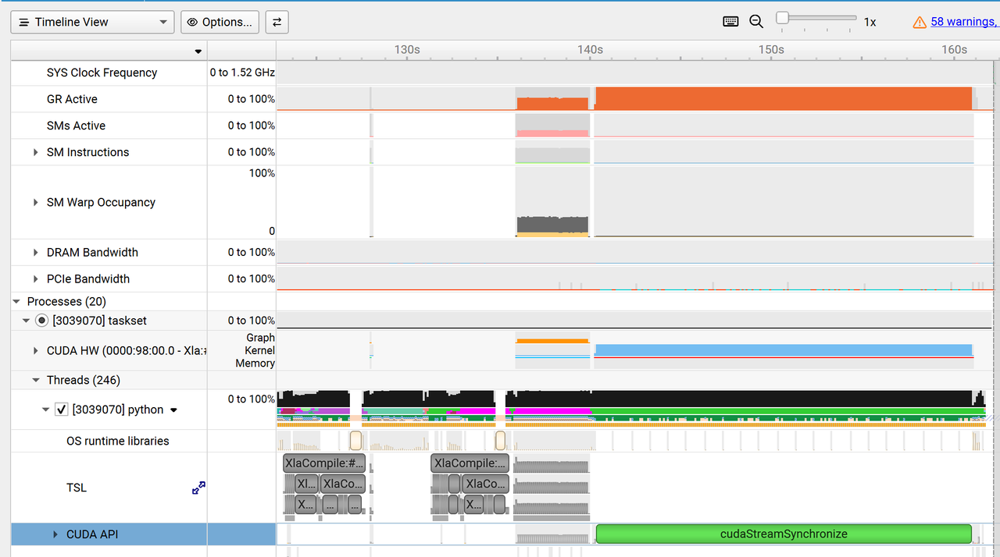

以输出分辨率128*128，128个envs为例
|  maniskill | mujoco(rt) | mujoco(raster) |
| --- | --- | --- |
| 110ms | 1.23s | 29.7ms |

raytracing基于cuda。可以利用JIT把python代码编译成XLA代码，将整个计算图发送到GPU执行，比如生成一些fused kernel。

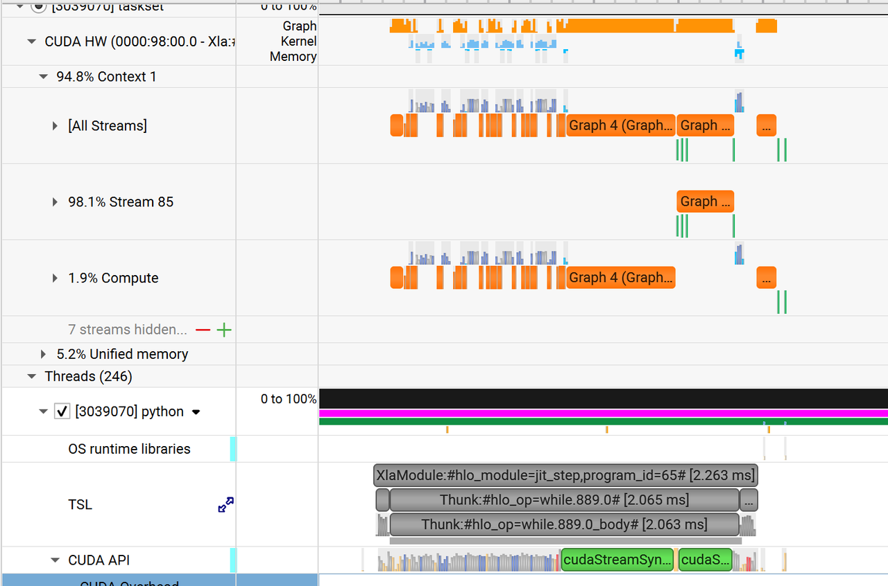

raster基于vulkan

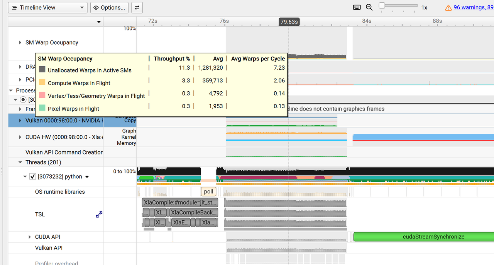

详细的代码可以见大项目里的mujoco目录

```python
to_keep = 64
rollout = [] 
def keep_until(state, i):
    return jax.tree.map(lambda x: x[:i], state) 
for i in range(episode_length):
    rng, act_rng = jax.random.split(rng)
    act_keys = jax.random.split(act_rng, num_envs)
    action, _ = inference_fn(state.obs, act_keys)
    state = jit_step(state, action)
    rollout.append(keep_until(state, to_keep))
    if (i+1) % 10 == 0:
        print(f"Step {i+1}/{episode_length}")
        
pixelss = []
print("run steps", time.time()-t0)
to_keep = 64
def keep_until(state, i):
    return jax.tree.map(lambda x: x[:i], state) #state里有许多中数据，每个都是envs维度，但是不能直接切片，这个就是来切片的

for i in range(episode_length):
    act = jax.random.uniform(
        key_act, (num_envs, env.action_size), minval=-1.0, maxval=1.0
    )
    state = jit_step(state, act) 
    pixelss.append(keep_until(state, to_keep).obs['pixels/view_0'])         
```

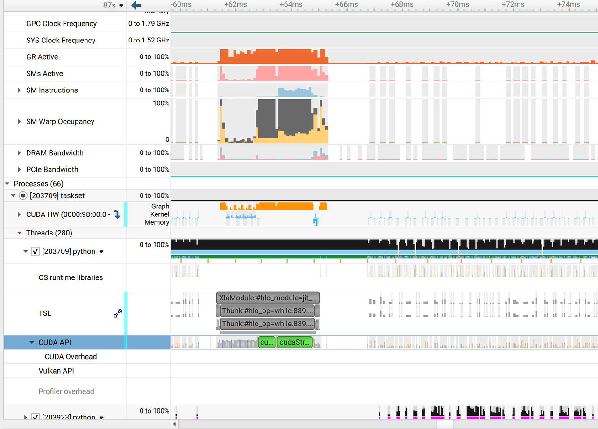

如果要保留每一步的渲染结果state，会导致两个step之间有很多不充分的指令比如非常多的loop_dynamic_slice_fusion和d2d，前者可能是因为选择性保留中的slice操作，但是也不太清楚为什么会有这么多次(num_envs=512时有110次)。即使只保留state的obs也不行，还是有。


继续看mujoco playground的并行性

基于vulkan的raster，整体很稳定.
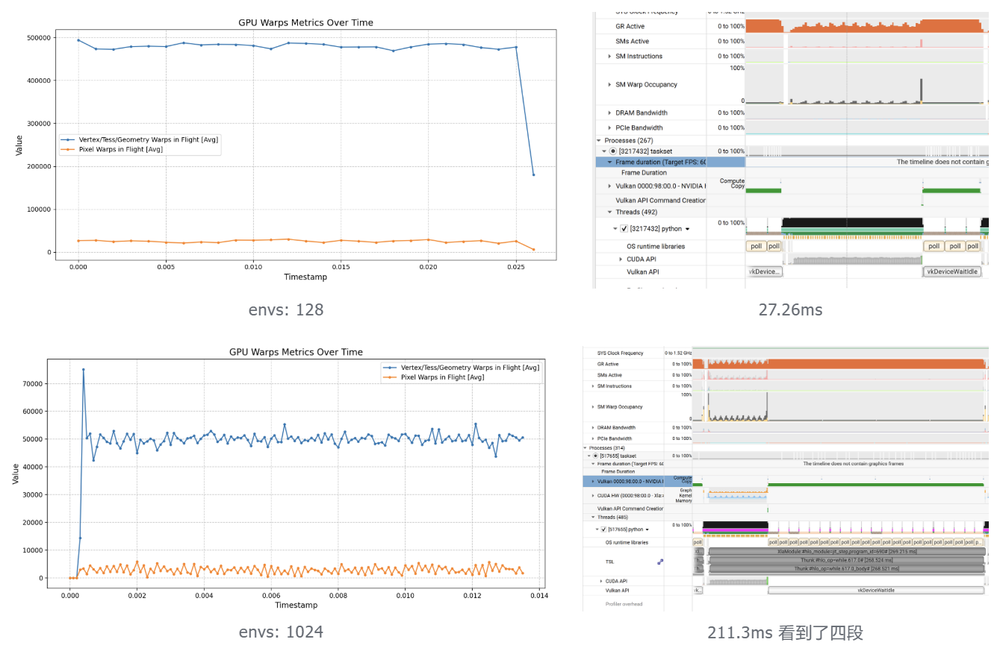


但是发现envs=1024时分了4段，很有可能有个最大并行度然后就分块了，联想一下肯定有个256的参数，果然在代码里找到了。就是这种基础的并行性使得比maniskill好得多？毕竟都是vulkan和相同的GPU，硬件因素也说不过去。

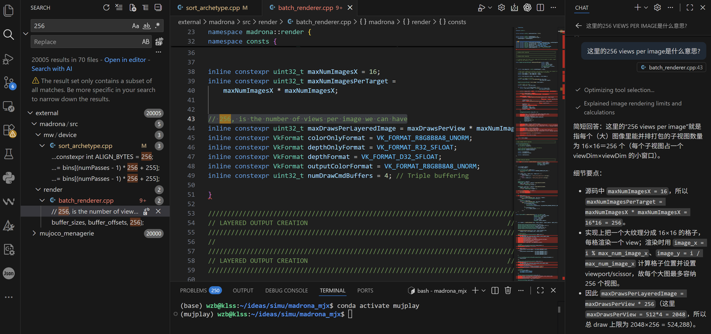

于是因为这种分块并行性，随环境数的scale情况，不能说很好：从128-1024，环境数增加了8倍，但FPS仅2倍。渲染时间的增加还是成为了瓶颈，但是完全可以用更大的子视图数量来搞。

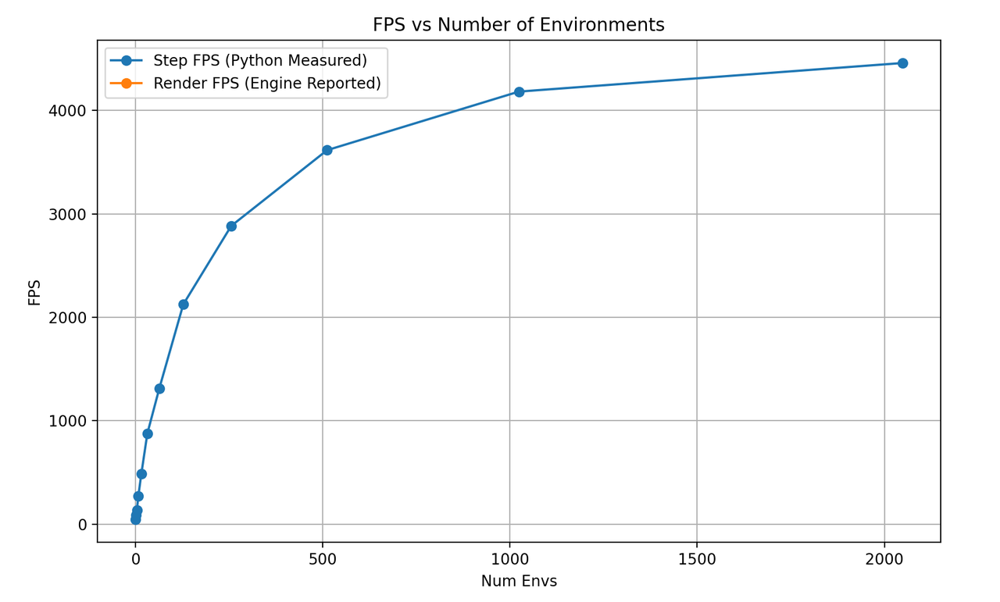

基于cuda的raytracing，算力堆满，整体scale很好，但其实渲染部分也不能scale，只是因为很快，导致整体上看着并没变缓。

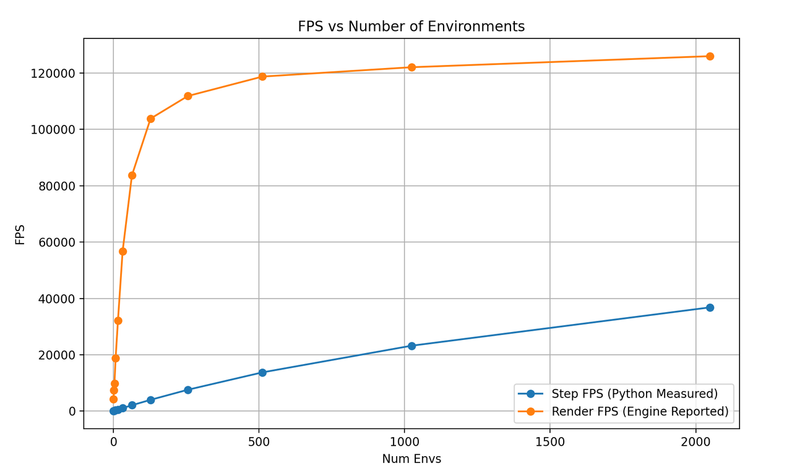

发现在envs=512/1024时，compute warp数量差不多，260w左右，avg warps是15.4(一个sm最多有64个active warp，实际会根据资源数量动态变化)，但是肯定还是没有到达H200的算力上限，同样也是256的子视图数量导致了并行数稳定。

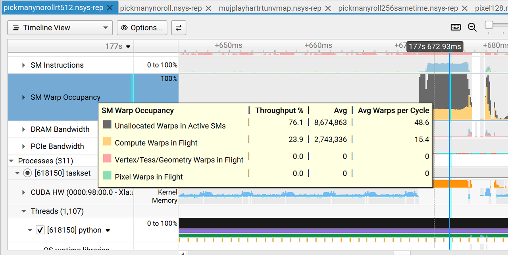

我再gs-madrona里也找到了类似的图，发现他也是在差不多256/512并行环境数下趋于稳定，交叉验证下上面的分析就是对的。

不过同时也对我的研究宣判了死刑，已经有足够好的render了，哪怕很多仿真器的render很烂，但这里已经有个足够好的了，而且如果把子视图数量从256继续增大，预期应该也会有进一步的提升，GPU的算力也应该可以堆满。


当然madrona并不是完美的，initECS时间很久(30-40s)，jit时间也很久(60s)，不过对于一种类型的任务来说，后面可以多次生成(比如先运行1024个，reset后再运行1024个)，那这些一次性的时间也并不重要了。
envs=256时，在180多s的程序中，真正用于跑推理/仿真/渲染的只有16.7s，不到10%。

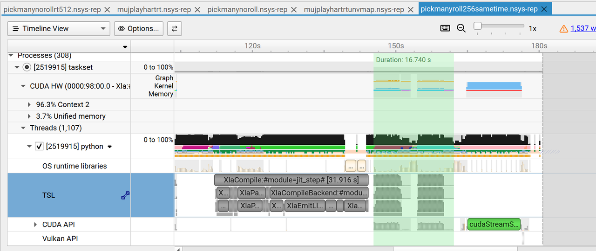

而完成1024个envs时，尽管由于视频生成的时间变长了，仍然也只占了31%；如果不算视频生成，即也使用vision做推理，但是不保留并传到CPU上，那更只占比3.7%，只需要7s即可完成在GPU上的并行仿真和渲染。

#### 新坑

在上一个工作宣判死刑之后，曲折的道路还在前进。

我把视角从导师指定的仿真器切换到了VLA，从端侧实用性上考虑，希望可以借助现成工具的grouding能力，减少VLA的高频调用(比如chunk size=5)。现在也有一点似了。